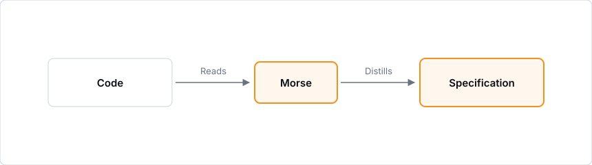
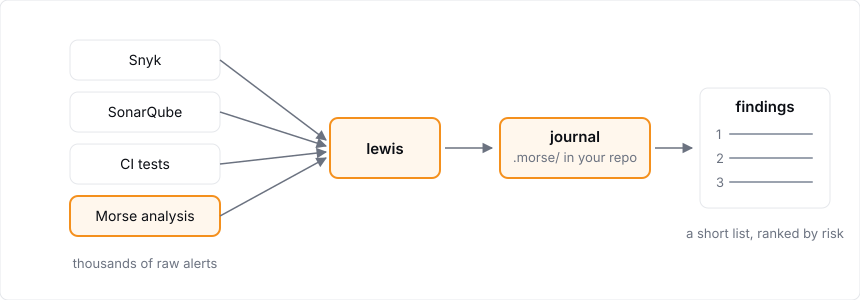
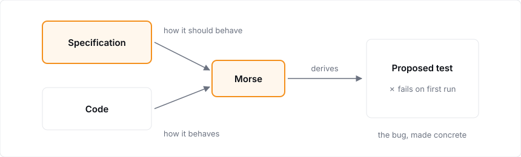
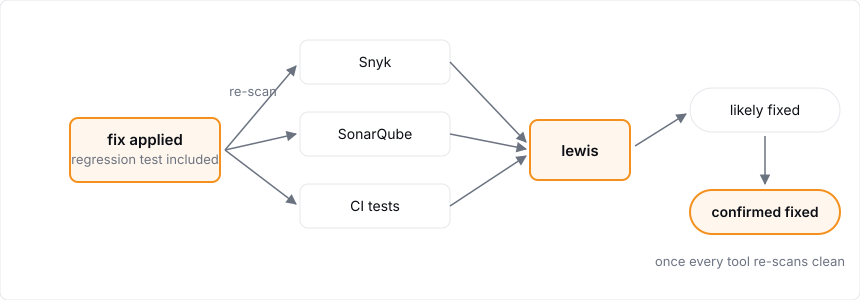
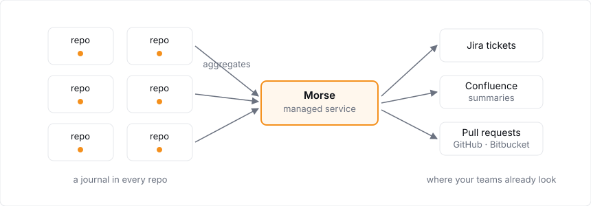

Back in 2020, the median time between a vulnerability being disclosed and first being exploited was over 6 months. This year, for the first time, that median has <a href="https://zerodayclock.com" target="_blank">gone negative</a>. This means that more than half of new CVEs are reported after their first confirmed in-the-wild exploitation.

In April 2026, Anthropic gave around fifty operators of critical infrastructure access to a gated model under [Project Glasswing](https://www.anthropic.com/news/expanding-project-glasswing). Within two months, roughly two hundred organisations had reported [more than ten thousand](https://blog.cloudflare.com/cyber-frontier-models/) high- and critical-severity flaws, some of which had sat unnoticed in major operating systems and browsers for decades.

## The problem with CVEs

Historically, defence has meant static analysis against databases of known problems: Common Vulnerabilities and Exposures, or CVEs. Dependency tools like [Snyk](https://snyk.io) match your inventory against feeds of known-vulnerable packages; code analysers like [SonarQube](https://www.sonarsource.com/products/sonarqube/) match your source against catalogued weakness patterns. The catalogues keep growing: more than [48,000 CVEs](https://www.infosecurity-magazine.com/news/first-forecasts-record-50000-cve/) were published last year.

There are now two problems with this approach.

The first problem is timing: with the median exploit arriving before its disclosure, a CVE database describes where attackers have already been, and patching from it can only chase them.

The second is coverage: CVE databases describe known issues in dependencies, but they have far less to say about the weaknesses in your own code, and an attacker doesn't care where the weakness lies.

For example, [EchoLeak](https://checkmarx.com/zero-post/echoleak-cve-2025-32711-show-us-that-ai-security-is-challenging/), the zero-click flaw disclosed in Microsoft 365 Copilot in 2025, chained behaviours that were each harmless on their own. A reference-style Markdown image slipped the filter meant to redact links; its source pointed at a Microsoft domain the content-security policy already trusted, so the browser fetched it automatically and carried a user's private data out to an attacker. The exploit was possible because of the gap between what the code did and what its authors intended it to do.

Weaknesses like these can't be patched in the traditional sense, because finding them means knowing what the code is _meant to do_ and noticing where it does more than it should. Secure code does everything it needs to do and nothing else: no side effects its authors didn't intend, no edge cases where its behaviour is loosely defined.

## The problem with AI red-teaming

The obvious response, and the one much of the industry has settled on, is AI red teaming: point the same frontier models at your own code before an adversary does. It works: last year a researcher used one to [find a remote zero-day](https://sean.heelan.io/2025/05/22/how-i-used-o3-to-find-cve-2025-37899-a-remote-zeroday-vulnerability-in-the-linux-kernels-smb-implementation/) in the Linux kernel's SMB implementation.

But red teaming is an open-ended search. It ends when the budget ends, not when the code is proven safe. Across millions of lines a thorough sweep can run into the many thousands of dollars, and a clean run proves only that *this model* used *this budget* and found nothing *this time*.

The money buys a report, but the code is a moving target. Every subsequent commit takes the codebase a little further from the one that was checked.

## Introducing Morse

**Morse** is our answer. Rather than patching CVEs retrospectively, or asking AIs to sweep your codebase for issues, Morse works out what the code you write is trying to achieve, and expresses that in a precise, formal specification. The specification is a durable representation of the intended behaviour, and provides the necessary grounding for an AI to harden the code until only that intended behaviour remains.

This is a radically different approach. A scanner can tell you that a function ignores a return code; Morse reasons about your code in the terms of your domain. Code hardened this way withstands exploits nobody has invented yet.

We've called it Morse for two reasons.

* Morse code turns a message into dots and dashes that anyone who knows the code can read straight back. A codebase is layers of recorded human intent waiting to be read the same way.
* Morse is the Oxford detective who worked patiently from evidence and preferred corroboration to confidence.

Inspector Morse never worked alone; he had his faithful assistant Lewis. Our Morse has the same: the command line tool that does the legwork, scanning, ingesting and raising tickets from your terminal or your CI, is called `lewis`.

## How Morse works

Morse begins by reading the codebase and distilling a behavioural specification: a statement of what the code is evidently meant to do, in the language of your domain.

Recovering specifications from programs is a research problem with a long history, but where earlier techniques could only surface machine-level invariants, current models produce [formally verifiable specifications](https://dl.acm.org/doi/10.1109/ICSE55347.2025.00129) for most benchmark programs. The distillation is itself diagnostic: where a tangle of rules governs a small area of code, there is usually something worth a closer look.

### It extracts signal from noise

Morse runs alongside the tools you already have. If you already use scanners such as Snyk or SonarQube, `lewis` can ingest their reports next to Morse's own analysis. Every observation, from a CVE match to a behavioural divergence, is recorded in a journal committed to your repository in a documented open format.

Observations are grouped into a short list of findings, so duplicate reports of a single flaw collapse into a single finding no matter how many tools flagged it. Ranking combines [CISA's known-exploited catalogue](https://www.cisa.gov/known-exploited-vulnerabilities-catalog) and [EPSS](https://www.first.org/epss/) probabilities with Morse's own severity assessment, so the list is ordered by risk. What reaches your team is the shape of the problem, in a handful of findings instead of thousands of raw alerts.

### It anchors to what the code should do

Good tests offer the best proof that code behaves the way it should. Before any fix, Morse asks whether the existing tests can be trusted.

Coverage alone doesn't make tests trustworthy. Because the specification says how the code should behave, Morse can judge whether the tests check the right things. Where they are missing or weak it implements new ones, grounded in the specification. Since the specification describes properties of the system that must be true for all inputs, Morse can create hundreds or thousands of adversarial scenarios that exhaustively test and confirm correct edge case behaviour.

Sometimes the analysis finds that existing tests are passing when they shouldn't, because both the test and the code are wrong in the same way. Morse flags these findings too. Updates to tests are proposed which cause the tests to fail correctly, so your engineers can see the issues which were masked by a green test suite and yet latent in the code all along.

### It fixes without breaking things

With the intended behaviour pinned down in failing tests, Morse writes an implementation that satisfies them in the most secure way available.

A fix is reported as 'likely fixed' on the first clean scan, and as 'confirmed' once the other tools have independently re-scanned and agree. Morse is designed to make rigorous software development accessible and effective. Your team have the information they need in order to confirm and sign-off the fixes as successful.

### It scales from one repository to a fleet

The analysis is the same for one repository or a thousand; what changes is the shell around it.

At estate scale, Morse runs as a managed service that schedules scans across the fleet and aggregates what it finds, so one vulnerable dependency in forty services becomes one finding with forty instances to resolve. It works through the systems your teams already use, raising tickets in Jira, publishing summaries to Confluence and opening pull requests in GitHub or Bitbucket.

Both modes share the journal format, so a team that started with one repository can grow to multiple projects without friction.

## Why this is the right approach

Red teaming has no economies of scale: the next sweep costs what the last one did and delivers another report. Morse, adopted as part of the ongoing development process, puts the same budget into artefacts that last. Quality and security become sustainable habits of the development process itself, secure by construction rather than by periodic inspection.

The artefacts belong to you, and they live in your repository: the specification, the tests and the journal of every observation, decision and fix, all in an open format. There is no vendor database to depend on, and the whole history is inspectable in git by your team or your auditors.

### From reactive to proactive

This is the difference between patching and hardening. Patching is reactive work that, at best, keeps pace with the rate at which vulnerabilities grow. Hardening with Morse is proactive work that sets up a virtuous cycle: the specification and its tests make change safer, safer change raises quality, and higher quality leaves attackers less to work with.

An engagement ends with your team owning a codebase in better shape than we found it, and equipped to keep it that way.
